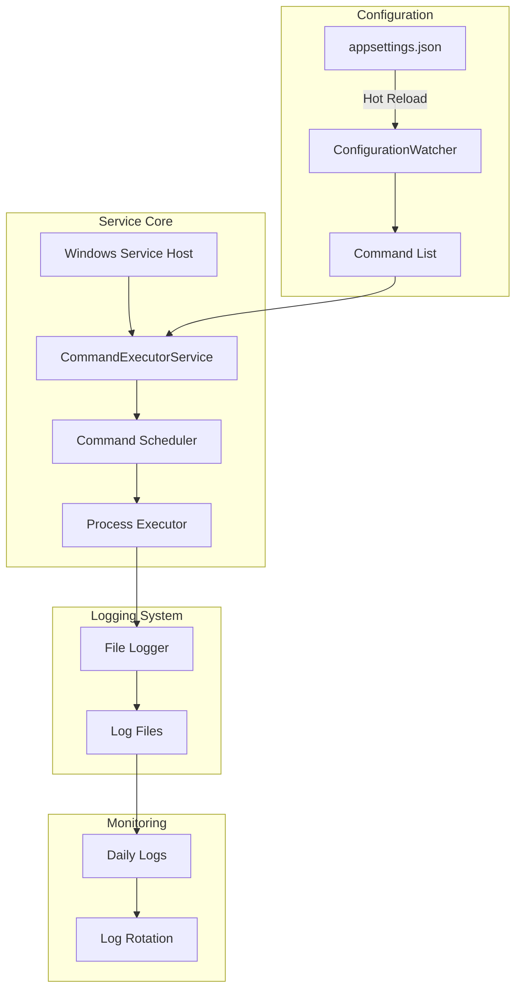
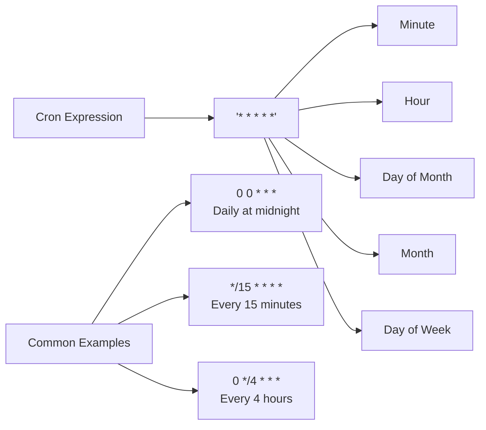
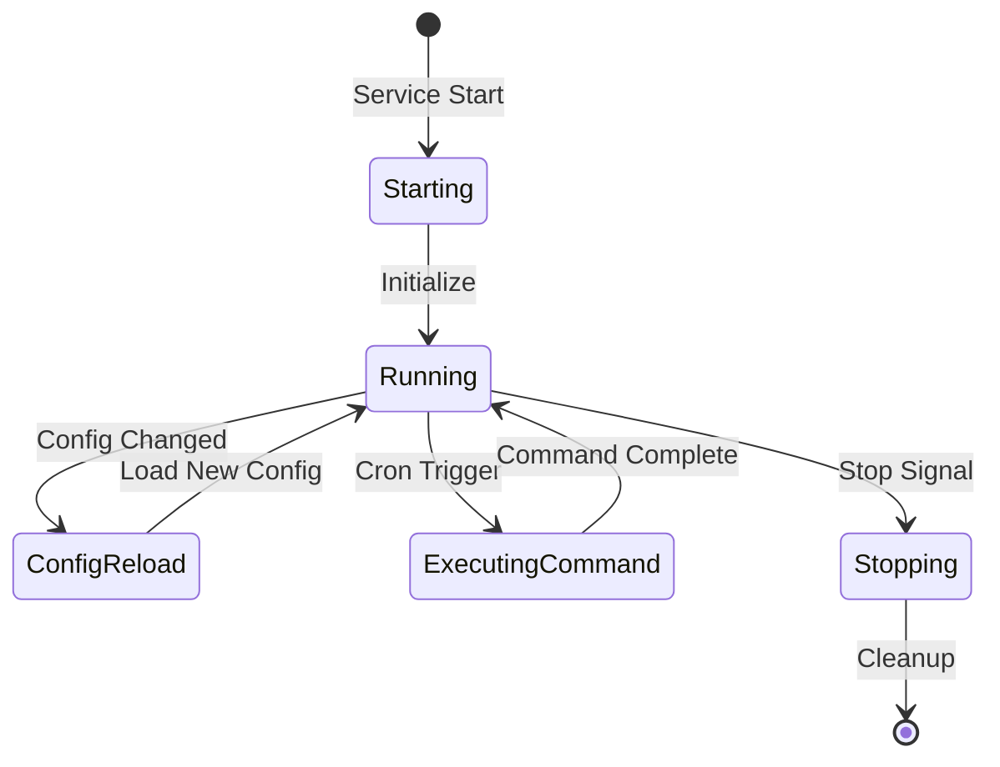

# Scheduled Command Executor Windows Service

**A lightweight Windows service** that runs commands on cron schedules, with:

* concurrency controls,
* per-job timeouts,
* live monitoring dashboard,
* alerts/hooks (optional),
* and a simple JSON config with hot-reload.

> **New in v2.8:** Correct time zone/DST scheduling across machine vs. job TZ (Cronos with UTC base + job TZ), non‑blocking scheduler loop, and case‑insensitive `validateCron` endpoint alias.
> **New in v2.7:** dashboard timestamps now respect the viewer's local time with wrapped cells, and failed jobs always log a summary even when CaptureOutput=false.
> **Previously in v2.6:** edge-to-edge dashboard layout that uses the full viewport, auto-fit KPI cards, mobile-first tables that wrap long values, and safer Windows-service hosting defaults.

## What's New
- **v2.8:**
  - Fixed next-run calculations when machine TZ differs from job `TimeZone` and across DST transitions by using Cronos’ time zone API with a UTC base time.
  - Scheduler loop no longer blocks while a job executes; due jobs are dispatched in the background with concurrency limits respected.
  - `POST /api/jobs/validateCron` now matches runtime calculations; also supports the lowercase alias `/api/jobs/validatecron`.
- **v2.7:** Local-time dashboard everywhere plus guaranteed failure logging regardless of CaptureOutput.
- **v2.6:** Edge-to-edge layout, adaptive KPIs, mobile-friendly tables, safer Windows service defaults.

---

## 🔍 Overview

This Windows Service allows administrators to:
- Schedule command execution using cron expressions
- Dynamically update commands without service restart
- Monitor execution through detailed logging
- Run system commands with proper Windows privileges

## 🏗️ Architecture



## ✨ Features

- **Cron-based Scheduling**: Use standard cron expressions for flexible command scheduling
- **Local-first Dashboard (new in v2.7)**: UI renders all timestamps in the browser's local time while keeping UTC hints in tooltips
- **Hot Configuration Reload**: Update commands without service restart
- **Comprehensive Logging**: Detailed logs with automatic rotation
- **Windows Service Integration**: Proper Windows service lifecycle management
- **Error Handling**: Robust error handling with detailed logging
- **Service Description**: Clear service description in Windows Services manager

## 📋 Prerequisites

- Windows OS
- .NET 9.0 (build target)
- Administrative privileges for service installation

## 🚀 Installation

Option A — Debug run (console)
```powershell
dotnet build -c Debug
dotnet run --project .\RunCommandsService\RunCommandsService.csproj
```

Option B — Install as a Windows Service (recommended)

1) Publish binaries
```powershell
dotnet publish .\RunCommandsService\RunCommandsService.csproj -c Release -o C:\Apps\RunCommandsService
```

2) Reserve HTTP prefix (run PowerShell as Administrator)

- For local debug under your current user:
```powershell
netsh http delete urlacl url=http://localhost:5058/
netsh http add urlacl url=http://localhost:5058/ user="%USERDOMAIN%\%USERNAME%"
```

- For the Windows service running as LocalSystem:
```powershell
netsh http add urlacl url=http://+:5058/ user="NT AUTHORITY\SYSTEM"
```

3) Install service

- Using `sc.exe`:
```powershell
sc.exe create "ScheduledCommandExecutor" binPath= "C:\Apps\RunCommandsService\RunCommandsService.exe" start= auto
sc.exe start "ScheduledCommandExecutor"
```

- Or using PowerShell `New-Service`:
```powershell
New-Service -Name "ScheduledCommandExecutor" `
            -BinaryPathName "C:\Apps\RunCommandsService\RunCommandsService.exe" `
            -DisplayName "Scheduled Command Executor" `
            -Description "Executes scheduled commands from appsettings.json" `
            -StartupType Automatic
Start-Service "ScheduledCommandExecutor"
```

4) Verify API and dashboard
```powershell
curl http://localhost:5058/api/health
start http://localhost:5058/
```

Notes
- Ensure `Monitoring:HttpPrefixes` contains `http://localhost:5058/` (with trailing slash) to match the reserved URL.
- To update: `sc.exe stop ScheduledCommandExecutor`, replace files in `C:\Apps\RunCommandsService`, then `sc.exe start ScheduledCommandExecutor`.
- To uninstall: `sc.exe stop ScheduledCommandExecutor` (if running) and `sc.exe delete ScheduledCommandExecutor`.

## ✨ Features

- **Cron-based Scheduling**: Use standard cron expressions for flexible command scheduling
- **Local-first Dashboard (new in v2.7)**: UI renders all timestamps in the browser's local time while keeping UTC hints in tooltips
- **Hot Configuration Reload**: Update commands without service restart
- **Comprehensive Logging**: Detailed logs with automatic rotation
- **Windows Service Integration**: Proper Windows service lifecycle management
- **Error Handling**: Robust error handling with detailed logging
- **Service Description**: Clear service description in Windows Services manager

## 📋 Prerequisites

- Windows OS
- .NET 9.0 (build target)
- Administrative privileges for service installation


## ✨ Features

- **Cron-based Scheduling**: Use standard cron expressions for flexible command scheduling
- **Local-first Dashboard (new in v2.7)**: UI renders all timestamps in the browser's local time while keeping UTC hints in tooltips
- **Hot Configuration Reload**: Update commands without service restart
- **Comprehensive Logging**: Detailed logs with automatic rotation
- **Windows Service Integration**: Proper Windows service lifecycle management
- **Error Handling**: Robust error handling with detailed logging
- **Service Description**: Clear service description in Windows Services manager

## 📋 Prerequisites

- Windows OS
- .NET 9.0 (build target)
- Administrative privileges for service installation

## ✨ Features

- **Cron-based Scheduling**: Use standard cron expressions for flexible command scheduling
- **Local-first Dashboard (new in v2.7)**: UI renders all timestamps in the browser's local time while keeping UTC hints in tooltips
- **Hot Configuration Reload**: Update commands without service restart
- **Comprehensive Logging**: Detailed logs with automatic rotation
- **Windows Service Integration**: Proper Windows service lifecycle management
- **Error Handling**: Robust error handling with detailed logging
- **Service Description**: Clear service description in Windows Services manager

## 📋 Prerequisites

- Windows OS
- .NET 9.0 (build target)
- Administrative privileges for service installation

## ⚙️ Configuration

Create an `appsettings.json` file in the service directory:

```json
{
  "Logging": {
    "LogLevel": {
      "Default": "Information",
      "Microsoft": "Warning",
      "Microsoft.Hosting.Lifetime": "Information"
    }
  },
  "ScheduledCommands": [
    {
      "Command": "C:\\Windows\\System32\\inetsrv\\appcmd stop site /site.name:yoursite",
      "CronExpression": "0 0 * * *"
    },
    {
      "Command": "C:\\Windows\\System32\\inetsrv\\appcmd start site /site.name:yoursite",
      "CronExpression": "5 0 * * *"
    }
  ]
}
```

### Cron Expression Examples



## 📝 Logging

Logs are stored in the `Logs` directory with the following features:
- Guaranteed failure summaries even when job output is not captured (v2.7)
- Daily log files (`log_yyyy-MM-dd.txt`)
- Automatic rotation after 30 days
- Size limit of 10MB per file
- Detailed timestamp and log level information

Example log entry:
```
2024-02-23 14:30:15 [Information] Service started
2024-02-23 14:30:16 [Information] Loaded 3 commands from configuration
2024-02-23 14:30:20 [Information] Starting command execution: C:\Windows\System32\inetsrv\appcmd stop site...
```

## 🔄 Service Lifecycle



## 🛠️ Development

### 🧱 Project Structure

```
RunCommandsService/
├─ Program.cs # Host setup (Windows Service, DI, logging)
├─ CommandExecutorService.cs # Scheduler/executor core (cron, concurrency, run/timeout)
├─ Monitoring.cs # HTTP dashboard (/ + /api/health + /api/logs + Job Builder APIs)
├─ ConcurrencyManager.cs # Keyed lock to prevent overlapping runs
├─ SchedulerOptions.cs # Scheduler configuration (PollSeconds, DefaultTimeZone, etc.)
├─ FileLogger.cs # Rolling file logger (daily log_*.txt in base/ or Logs/)
├─ WebhookNotifier.cs # (Optional) webhook alert notifier (implements IAlertNotifier)
├─ HealthHttpServerService.cs # Back-compat no-op hosted service
├─ dashboard.html # Standalone UI (cards, tables, logs tail, Job Builder modal)
├─ favicon.ico # Dashboard icon
├─ appsettings.json # Configuration (Monitoring, Notifiers, ScheduledCommands)
├─ README.md # Documentation
└─ Logs/ # (runtime) log directory; API tails newest file in base/logs/Log/


### Key files
- **Monitoring.cs** – serves the dashboard and exposes Job Builder endpoints  
  `GET /api/health`, `GET /api/logs?tailKb=128`, `GET/POST/PUT/DELETE /api/jobs`, `POST /api/jobs/validateCron`
- **CommandExecutorService.cs** – cron scheduling, concurrency, max runtime, graceful shutdown
- **appsettings.json** – includes `ScheduledCommands` and `Monitoring` (`AdminKey` for Job Builder writes)
- **dashboard.html** – UI with KPIs, tables, logs tail, “+ New job” wizard (cron preview)

> Notes:  
> • The service also tails daily `log_YYYY-MM-DD.txt` in the base folder and will read from `log/` or `Logs/` if present.  
> • Set `Monitoring:Dashboard:HtmlPath` if you move the HTML.

```

## 🤝 Contributing

1. Fork the repository
2. Create a feature branch
3. Commit your changes
4. Push to the branch
5. Create a Pull Request

## 📜 License

MIT License - feel free to use this code in your projects.

## 🚨 Common Issues and Solutions

1. **Service Won't Start**
   - Check Windows Event Viewer for errors
   - Verify appsettings.json exists and is valid
   - Ensure proper permissions on log directory

2. **Commands Not Executing**
   - Verify cron expressions are correct
   - Check service logs for execution attempts
   - Ensure commands have proper paths

3. **Configuration Not Updating**
   - Verify file system permissions
   - Check logs for configuration reload events
   - Ensure JSON format is valid

## 🔍 Monitoring and Maintenance

1. **Log Monitoring**
   - Check daily log files in the Logs directory
   - Monitor command execution status
   - Review error logs for issues

2. **Performance Considerations**
   - Monitor log file sizes
   - Check command execution times
   - Verify configuration reload performance

## 📊 Best Practices

1. **Command Configuration**
   - Use full paths in commands
   - Set appropriate cron schedules
   - Include command descriptions in config

2. **Logging**
   - Regular log review
   - Maintain adequate disk space
   - Archive important logs

3. **Security**
   - Run service with appropriate privileges
   - Secure access to configuration file
   - Monitor command execution results

## 🔗 Related Resources

- [Windows Service Documentation](https://docs.microsoft.com/en-us/dotnet/framework/windows-services/)
- [Cron Expression Generator](https://crontab.guru/)
- [.NET Core Documentation](https://docs.microsoft.com/en-us/dotnet/core/)
</antArtifact>

This documentation provides:
1. Clear architecture diagrams
2. Detailed setup instructions
3. Configuration examples
4. Best practices and troubleshooting
5. Maintenance guidelines

Would you like me to:
1. Add more technical details to any section?
2. Include additional diagrams?
3. Expand any particular topic?
4. Add code examples for specific scenarios?

## ⚙️ Configuration (excerpt of `appsettings.json`)

```json
{
  "Scheduler": {
    "PollSeconds": 5,
    "MaxParallelism": 2,
    "DefaultTimeZone": "America/New_York"
  },
  "Monitoring": {
    "EnableHttpEndpoint": true,
    "HttpPrefixes": [ "http://localhost:5058/" ],
    "AlertOn": {
      "ConsecutiveFailures": 2,
      "ExecutionTimeMsThreshold": 60000
    },
    "Notifiers": {
      "Email": {
        "Enabled": false,
        "SmtpHost": "smtp.example.com",
        "SmtpPort": 587,
        "UseSsl": true,
        "User": "user@example.com",
        "Password": "CHANGE_ME",
        "From": "alerts@example.com",
        "To": [ "ops@example.com" ]
      },
      "Webhook": {
        "Enabled": false,
        "Url": "https://hooks.example.com/your-webhook"
      }
    }
  },
  "ScheduledCommands": [
    {
      "Id": "notepad",
      "Command": "notepad.exe",
      "CronExpression": "*/5 * * * *",
      "TimeZone": "UTC",
      "Enabled": true,
      "MaxRuntimeMinutes": 5,
      "AllowParallelRuns": false,
      "ConcurrencyKey": "ui-apps",
      "AlertOnFail": true
    }
  ]
}
```

## 📡 Health endpoint

If enabled, the service exposes a JSON health snapshot at the prefixes in `Monitoring.HttpPrefixes` (default: `http://localhost:5058/`).

**First time on Windows**, grant URL ACL (elevated PowerShell/cmd):

```powershell
netsh http add urlacl url=http://+:5058/ user=Everyone
```

Use a browser or `curl http://localhost:5058/` to see recent runs, durations, exit codes, and consecutive failures.

## 🛡️ Operational guidance

- Group mutually‑exclusive jobs by the same `ConcurrencyKey` (e.g., `"db-backups"`, `"reports"`), and set `AllowParallelRuns=false`.
- Start with `MaxParallelism = 1`; increase gradually while watching durations in the health endpoint.
- Set `MaxRuntimeMinutes` to auto‑recover from stuck processes.
- Configure both **Webhook** (chat/ops) and **Email** (audit) notifiers for redundancy.

## 🧪 Examples

**Run a PowerShell script every hour, only one at a time, kill after 20 minutes:**

```json
{
  "Id": "hourly-report",
  "Command": "powershell.exe -ExecutionPolicy Bypass -File C:\\Jobs\\HourlyReport.ps1",
  "CronExpression": "0 * * * *",
  "TimeZone": "America/New_York",
  "AllowParallelRuns": false,
  "ConcurrencyKey": "reports",
  "MaxRuntimeMinutes": 20,
  "AlertOnFail": true
}
```

**Two independent maintenance tasks concurrently, different keys:**

```json
{ "Id": "cache-warm", "Command": "C:\\Jobs\\Warm.exe", "CronExpression": "*/10 * * * *", "ConcurrencyKey": "cache" },
{ "Id": "log-trim",   "Command": "C:\\Jobs\\Trim.exe", "CronExpression": "*/10 * * * *", "ConcurrencyKey": "logs"  }
```

## 📊 Dashboard: wide mode, scroll & live logs

The HTML dashboard now makes better use of screen real estate and scales to large histories.

- **Wide mode** toggle to expand content to ~96% viewport width.
- **Sticky headers** with **vertical & horizontal scroll** for both *Scheduled Jobs* and *Recent Executions* tables.
- **KPI cards**: Events, OK, Failed, Avg Duration — fed from `/api/health`.
- **Service Logs (tail)** card shows the tail of the latest log file and auto-refreshes.

### Logs API
The dashboard calls a new endpoint to read the tail of the service logs:

- `GET /api/logs?tailKb=128` → returns the last `tailKb` KB of the newest log file.
- Searches common locations: app base folder, `/log`, `/logs` (e.g., `log_*.txt` or any `*.txt` inside those dirs).
- Response content type: `text/plain; charset=utf-8`.

> Tip: use **Follow** to auto-scroll as new log lines appear, and **Copy** to put the visible tail into the clipboard.

## 🏃 Detached jobs (fire‑and‑forget)

If a command should *launch and keep running* (daemon-style), you can start it without blocking the scheduler:

```json
{
  "Id": "SistemaAutomatizadoDashboard",
  "Command": "cmd /c \"pushd C:\\\\Apps\\\\SistemaAutomatizadoDashboard && start \\\"\\\" /b \\\"%ProgramFiles%\\\\nodejs\\\\node.exe\\\" src\\\\main.js process\"",
  "CronExpression": "40 23 * * 1-5",
  "TimeZone": "Eastern Standard Time",
  "Enabled": true,
  "AllowParallelRuns": false,
  "ConcurrencyKey": "dashboard",
  "MaxRuntimeMinutes": 5,
  "AlertOnFail": true,
  "CaptureOutput": false,
  "QuietStartLog": true,
  "CustomAlertMessage": "Dashboard pipeline kicked off; refer to the app’s own logs for runtime details."
}
```

Why:

- `start "" /b …` spawns the process and returns immediately — no scheduler blocking.
- Keep `CaptureOutput: false` (your app handles logging) and a small `MaxRuntimeMinutes` (detached runs don’t need it).
- If overlap is risky, implement a lock/guard inside your app (PID/lock file or mutual exclusion in your code).

## 🔧 Job Builder (Dashboard)

From the dashboard, click **“+ New job”** to open the wizard. You can:
- set **Id**, **Command**, **TimeZone**, **ConcurrencyKey**, **AllowParallelRuns**, **MaxRuntimeMinutes**, `CaptureOutput`, `QuietStartLog`, `AlertOnFail`, and **CustomAlertMessage**.
- enter a **Cron expression** and click **Preview** to see the **next 5 UTC** runs (server-side validate).
- save the job (atomic write to `appsettings.json`), and the service auto-reloads the schedule.

### Security
Write endpoints require a header **`X-Admin-Key`**. Set it in your config:
```json
{
  "Monitoring": {
    "AdminKey": "put-a-strong-random-key-here"
  }
}
```

### APIs
- `GET  /api/jobs` - list current jobs (raw from config)
- `POST /api/jobs/validateCron` - body: `{ "cron": "*/5 * * * *", "timeZone": "Eastern Standard Time" }`
- `POST /api/jobs` - create job (body is the job JSON)
- `PUT  /api/jobs/{id}` - update by id
- `DELETE /api/jobs/{id}` - delete by id

Aliases: `POST /api/jobs/validatecron` (lowercase) is also accepted.

All write calls must include the header: `X-Admin-Key: <your-key>`.

### Example job JSON (Node task, Mon–Fri 23:40 EST)
```json
{
  "Id": "SistemaAutomatizadoDashboard",
  "Command": "cmd /c \"pushd C:\\\\Apps\\\\SistemaAutomatizadoDashboard && \\\"%ProgramFiles%\\\\nodejs\\\\node.exe\\\" src\\\\main.js process\"",
  "CronExpression": "40 23 * * 1-5",
  "TimeZone": "Eastern Standard Time",
  "Enabled": true,
  "AllowParallelRuns": false,
  "ConcurrencyKey": "dashboard",
  "MaxRuntimeMinutes": 5,
  "AlertOnFail": true,
  "CaptureOutput": false,
  "QuietStartLog": true,
  "CustomAlertMessage": "Dashboard pipeline kicked off; refer to the app’s own logs for runtime details."
}
```

## 🛑 Graceful shutdown & cancellation

When the Windows Service stops (or the host restarts), the scheduler loop and any in-flight `RunCommandAsync` now treat
**`OperationCanceledException` / `TaskCanceledException` as normal**. We avoid false “error” logs and ensure child
processes are **killed cleanly** on timeout **or** shutdown.

## ⚙️ `appsettings.json` reference (v2.4)

### Top-level
```json
{
  "Scheduler": {
    "PollSeconds": 5,
    "DefaultTimeZone": "UTC",
    "MaxParallelism": 1
  },
  "Monitoring": {
    "EnableHttpEndpoint": true,
    "HttpPrefixes": [ "http://localhost:5058/" ],
    "AdminKey": null,
    "Dashboard": {
      "Enabled": true,
      "Title": "Scheduled Command Executor",
      "AutoRefreshSeconds": 5,
      "ShowRawJsonToggle": true,
      "HtmlPath": "dashboard.html"
    },
    "AlertOn": {
      "ConsecutiveFailures": 2,
      "SlowRunMs": 120000,
      "EmailOnFail": true,
      "EmailOnConsecutiveFailures": true
    },
    "Notifiers": {
      "Email": {
        "Enabled": false,
        "From": "",
        "To": [ "ops@contoso.com" ],
        "SmtpHost": "",
        "SmtpPort": 587,
        "UseSsl": true,
        "User": "",
        "Password": "",
        "SubjectTemplate": "[${AlertType}] ${CommandId} (${ConsecutiveFailures}x) — ${DurationMs}ms",
        "BodyTemplate": "Command: ${Command}\nStarted: ${StartUtc:o}\nEnded: ${EndUtc:o}\nExitCode: ${ExitCode}\nDuration: ${DurationMs}ms\nError: ${Error}\nMessage: ${CustomMessage}"
      }
      /* Optional: webhook example (if you wired WebhookNotifier)
      ,"Webhook": {
        "Enabled": true,
        "Url": "https://example/webhook",
        "AuthorizationHeader": "Bearer <token>"
      }*/
    }
  },

  "ScheduledCommands": [
    {
      "Id": "example",
      "Command": "cmd /c echo Hello",
      "CronExpression": "*/5 * * * *",
      "TimeZone": "UTC",
      "Enabled": true,
      "AllowParallelRuns": false,
      "ConcurrencyKey": "example",
      "MaxRuntimeMinutes": 10,
      "AlertOnFail": true,
      "CaptureOutput": true,
      "QuietStartLog": false,
      "CustomAlertMessage": "Friendly context in alerts"
    }
  ]
}
```

### Per-job options
- **Id** *(string, required)* – unique id.
- **Command** *(string, required)* – full shell command; Windows examples often use `cmd /c "..."` with quoting.
- **CronExpression** *(string, required)* – 5-field cron (min hour dom mon dow).
- **TimeZone** *(string)* – Windows tz id (e.g., `Eastern Standard Time`). Falls back to `Scheduler.DefaultTimeZone`.
- **Enabled** *(bool)* – include/exclude from scheduling.
- **AllowParallelRuns** *(bool)* – if `false`, jobs sharing the same **ConcurrencyKey** won’t overlap.
- **ConcurrencyKey** *(string)* – grouping key for mutual exclusion. If empty, `Id` is used.
- **MaxRuntimeMinutes** *(int?)* – cancels and kills the process after this duration.
- **AlertOnFail** *(bool)* – send alerts on failures (ties into Monitoring.Notifiers).
- **CaptureOutput** *(bool)* – if `true`, stdout/stderr are captured and logged; stderr content marks the run failed.
- **QuietStartLog** *(bool)* – suppresses the “Executing …” info log at start, useful for very frequent jobs.
- **CustomAlertMessage** *(string)* – extra context included in email/webhook templates.

### Monitoring endpoint & dashboard
- `Monitoring.HttpPrefixes` – list of prefixes for the built-in HTTP server (ex: `http://localhost:5058/`).
- `GET /api/health` – dashboard data (scheduled snapshot + recent executions).
- `GET /api/logs?tailKb=128` – returns the last *tailKb* KB of the newest log file (looks in base, `log/`, `logs/`).

### Job Builder write APIs (require `Monitoring.AdminKey`)
- `GET  /api/jobs`
- `POST /api/jobs/validateCron`
- `POST /api/jobs`
- `PUT  /api/jobs/{id}`
- `DELETE /api/jobs/{id}`

## Changelog

## 🐛 What's new (v2.8)

* Time zone correctness — Next-run is computed with Cronos using a UTC base time plus the job's `TimeZone`. Fixes wrong schedules when the machine TZ differs from the job TZ and across DST transitions.
* Loop resilience — The scheduler no longer blocks on job execution. Jobs are dispatched in the background; concurrency keys and `MaxParallelism` still apply.
* Cron preview parity — `POST /api/jobs/validateCron` uses the same logic as runtime and accepts lowercase alias `/api/jobs/validatecron`.
* Quick preview via curl:
  - `curl -H "Content-Type: application/json" -d '{ "cron":"*/5 * * * *", "timeZone":"Eastern Standard Time" }' http://localhost:5058/api/jobs/validateCron`
  - `curl -H "Content-Type: application/json" -d '{ "cron":"40 23 * * 1-5", "timeZone":"America/Santo_Domingo" }' http://localhost:5058/api/jobs/validatecron`

## 🐛 What's new (v2.7)

* **Local-time dashboard timestamps** - Recent executions, schedule tables, and status chips now render in the viewer's local time while retaining UTC hints on hover.
* **Wrapped monospace date columns** - `.mono wrap` styling keeps long timestamps readable without horizontal scrolling in jobs and executions.
* **Guaranteed failure summaries** - Every unsuccessful run writes a concise error log even when `CaptureOutput=false`, so failures never go unnoticed.

## 🌐 What’s new (v2.6)

* **Edge-to-edge dashboard layout** — wrappers now use 95% of the viewport width with responsive padding, eliminating wasted gutters on wide screens.
* **Adaptive KPI grid** — cards auto-fit via CSS so all stats remain visible on tablets and phones with no horizontal scroll.
* **Readable tables on mobile** — table cells wrap cron/time-zone text while keeping ID columns monospace; the toolbar stacks vertically with a fluid search box.
* **Safer Windows service integration** — Program.cs aliases `WindowsServiceHelpers` to avoid naming conflicts with `Microsoft.Extensions.Hosting.WindowsServices`.

## ✅ What’s new (v2.5)

* **Responsive layout** — no page-level horizontal scrolling. Cells ellipsize, sections scroll within themselves.
* **Version chip** — visible at the top (e.g., `v2.4.0+…`) so testers know what’s deployed.
* **Cards** — Events, OK, Failed, Avg Duration.
* **Scheduled Jobs** — shows cron, TZ, key, parallel/timeout, **Next run in job’s TZ** (hover to see UTC).
* **Recent Executions** — sortable list with exit code, duration, status (OK / FAIL / Skipped (lock)).
* **Service Logs (tail)** — live tail with follow & size selector; wraps long lines.
* **Raw JSON** — button toggles pretty payload for quick diagnostics.
* **Job Builder (experimental)** — modal to create jobs via API, with cron preview (`/api/jobs/validateCron`). Requires `Monitoring.AdminKey`.

## ✨ What’s new (v2.4)

- **Job Builder in the dashboard** – create jobs from the UI, with cron builder and **live next-run preview**.
- **Write APIs** – `/api/jobs` (create/update/delete) and `/api/jobs/validateCron` (preview next occurrences).
- **Admin key** – protect write endpoints with `X-Admin-Key` (see config below).
- **Graceful shutdown** – the scheduler treats service shutdown as normal (no error logs), and kills child processes politely.
- **Docs** – expanded `appsettings.json` reference with all per-job flags (`CaptureOutput`, `QuietStartLog`, `AllowParallelRuns`, `ConcurrencyKey`, `MaxRuntimeMinutes`, `CustomAlertMessage`, `TimeZone`) and monitoring options.

## 🚀 What’s new (v2.3)

- **Dashboard UX upgrade** — wide mode toggle, sticky table headers, and both vertical & horizontal scroll for big lists.
- **KPI cards** restored and styled (Events, OK, Failed, Avg Duration).
- **Live Service Logs** panel with tail sizes, follow, and copy to clipboard (backs `/api/logs`).
- **More robust scheduling** — next occurrence is computed from the *due* instant, reducing missed ticks under load.
- **Reliable process handling** — clean timeout/kill with `WaitForExitAsync`.
- **Docs** — added recipes for **silent jobs** and **detached “fire‑and‑forget”** execution.

## 🔔 What’s new (v2.2)

- **Silent jobs**: per-task flags `CaptureOutput` and `QuietStartLog` let you run jobs without streaming their stdout/stderr into the service logs.
- **No behavior change by default**: both flags default to `CaptureOutput: true`, `QuietStartLog: false` to preserve existing behavior.
- **Observability intact**: we still track start/end time, duration, **exit code**, alerts, and show results on the dashboard.
- **Docs & examples**: added a dedicated “Silent jobs” section with ready-to-copy JSON.

### Quick example
```json
{
  "Id": "SistemaAutomatizadoDashboard",
  "Command": "cmd /c \"pushd C:\\\\Apps\\\\SistemaAutomatizadoDashboard && \\\"%ProgramFiles%\\\\nodejs\\\\node.exe\\\" src\\\\main.js process\"",
  "CronExpression": "40 23 * * 1-5",
  "TimeZone": "Eastern Standard Time",
  "Enabled": true,
  "AllowParallelRuns": false,
  "ConcurrencyKey": "dashboard",
  "MaxRuntimeMinutes": 60,
  "AlertOnFail": true,
  "CaptureOutput": false,
  "QuietStartLog": true,
  "CustomAlertMessage": "SistemaAutomatizadoDashboard failed on server; check the app’s own logs for details."
}
```
## ✅ What’s new (v2.1)

- **Personalized email alerts** — Subject/body **templates** with tokens and per‑job `CustomAlertMessage`.
- **Full HTML monitoring dashboard** at `/` plus `GET /api/health` JSON; now loads UI from an external `Monitoring.Dashboard.HtmlPath`.
- **Polished UI** — dark/light theme, KPIs, search, sorting, pause auto‑refresh.
- **More examples & use cases** for real‑world patterns (locking, rate‑limit staggering, time zones, long‑running guardrails).
- **API payload** standardized to **camelCase** keys for friendlier front‑end consumption.
- 
## ✅ What’s new (v2)

- **Monitoring & Health** — lightweight HTTP health endpoint (JSON) with rolling execution history.
- **Proactive Alerts** — Email and/or Webhook (Slack/Teams/Discord) on **consecutive failures** and **slow runs**.
- **Safe Concurrency** — global `MaxParallelism` plus per-job `ConcurrencyKey` locks to avoid overlapping tasks on shared resources.
- **Runtime Limits** — per-job `MaxRuntimeMinutes` auto‑kills hung processes.
- **Precise Scheduler** — uses Cronos to compute the next exact occurrence and prevent duplicate triggers.
- **Hot‑reload** — changes to `appsettings.json` are picked up without restarting the service.

