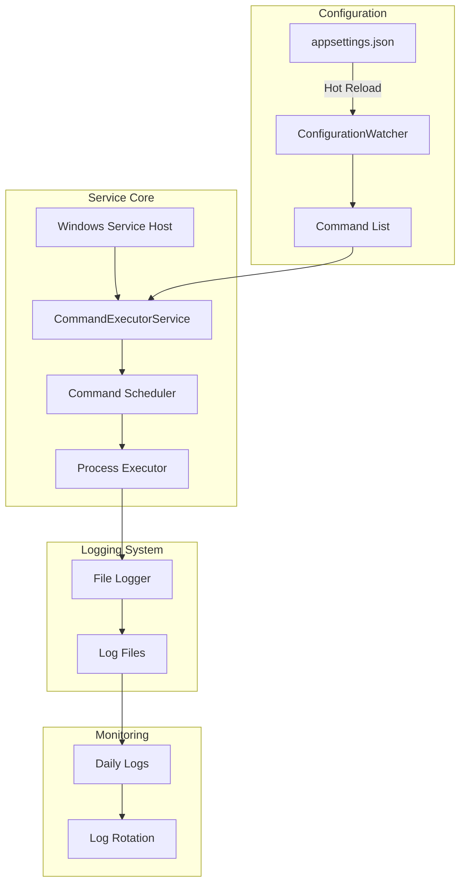
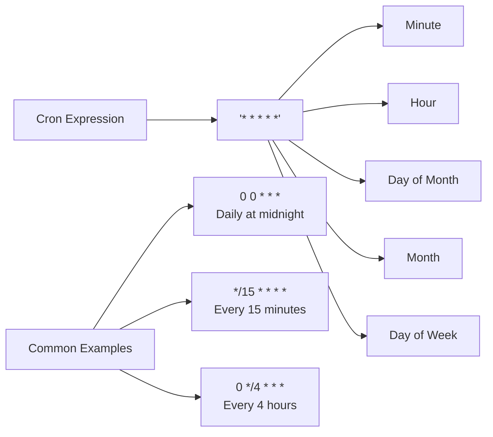
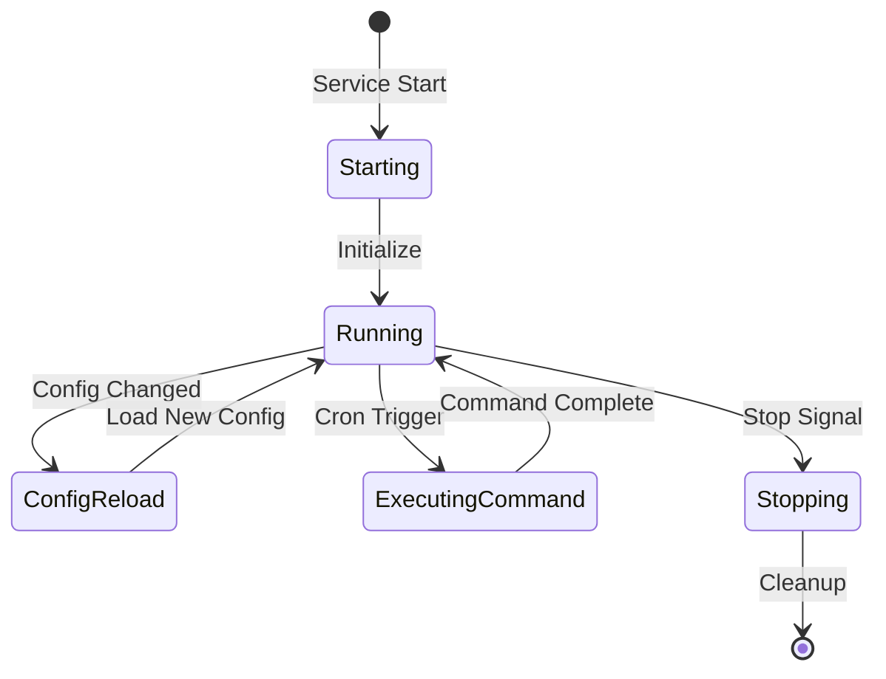

# Scheduled Command Executor Windows Service


## ✅ What’s new (v2)

- **Monitoring & Health** — lightweight HTTP health endpoint (JSON) with rolling execution history.
- **Proactive Alerts** — Email and/or Webhook (Slack/Teams/Discord) on **consecutive failures** and **slow runs**.
- **Safe Concurrency** — global `MaxParallelism` plus per-job `ConcurrencyKey` locks to avoid overlapping tasks on shared resources.
- **Runtime Limits** — per-job `MaxRuntimeMinutes` auto‑kills hung processes.
- **Precise Scheduler** — uses Cronos to compute the next exact occurrence and prevent duplicate triggers.
- **Hot‑reload** — changes to `appsettings.json` are picked up without restarting the service.

A robust Windows Service that executes scheduled commands based on cron expressions defined in a configuration file. The service supports hot-reload configuration and provides comprehensive logging capabilities.

## 🔍 Overview

This Windows Service allows administrators to:
- Schedule command execution using cron expressions
- Dynamically update commands without service restart
- Monitor execution through detailed logging
- Run system commands with proper Windows privileges

## 🏗️ Architecture



## ✨ Features

- **Cron-based Scheduling**: Use standard cron expressions for flexible command scheduling
- **Hot Configuration Reload**: Update commands without service restart
- **Comprehensive Logging**: Detailed logs with automatic rotation
- **Windows Service Integration**: Proper Windows service lifecycle management
- **Error Handling**: Robust error handling with detailed logging
- **Service Description**: Clear service description in Windows Services manager

## 📋 Prerequisites

- Windows OS
- .NET 6.0 or later
- Administrative privileges for service installation

## 🚀 Installation

1. **Build the Service**
```powershell
dotnet build -c Release
```

2. **Install the Service**
```powershell
New-Service -Name "ScheduledCommandExecutor" `
            -BinaryPathName "path\to\your\service.exe" `
            -DisplayName "Scheduled Command Executor Service" `
            -Description "Service that executes scheduled commands based on cron expressions defined in appsettings.json" `
            -StartupType Automatic
```

## ⚙️ Configuration

Create an `appsettings.json` file in the service directory:

```json
{
  "Logging": {
    "LogLevel": {
      "Default": "Information",
      "Microsoft": "Warning",
      "Microsoft.Hosting.Lifetime": "Information"
    }
  },
  "ScheduledCommands": [
    {
      "Command": "C:\\Windows\\System32\\inetsrv\\appcmd stop site /site.name:yoursite",
      "CronExpression": "0 0 * * *"
    },
    {
      "Command": "C:\\Windows\\System32\\inetsrv\\appcmd start site /site.name:yoursite",
      "CronExpression": "5 0 * * *"
    }
  ]
}
```

### Cron Expression Examples



## 📝 Logging

Logs are stored in the `Logs` directory with the following features:
- Daily log files (`log_yyyy-MM-dd.txt`)
- Automatic rotation after 30 days
- Size limit of 10MB per file
- Detailed timestamp and log level information

Example log entry:
```
2024-02-23 14:30:15 [Information] Service started
2024-02-23 14:30:16 [Information] Loaded 3 commands from configuration
2024-02-23 14:30:20 [Information] Starting command execution: C:\Windows\System32\inetsrv\appcmd stop site...
```

## 🔄 Service Lifecycle



## 🛠️ Development

1. **Project Structure**
```
├── Program.cs                 # Main service entry point
├── CommandExecutorService.cs  # Core service implementation
├── FileLogger.cs             # Logging implementation
├── appsettings.json          # Configuration file
└── Logs/                     # Log directory
```

2. **Adding New Features**
- Implement new functionality in `CommandExecutorService.cs`
- Update configuration schema in `appsettings.json`
- Add appropriate logging statements

## 🤝 Contributing

1. Fork the repository
2. Create a feature branch
3. Commit your changes
4. Push to the branch
5. Create a Pull Request

## 📜 License

MIT License - feel free to use this code in your projects.

## 🚨 Common Issues and Solutions

1. **Service Won't Start**
   - Check Windows Event Viewer for errors
   - Verify appsettings.json exists and is valid
   - Ensure proper permissions on log directory

2. **Commands Not Executing**
   - Verify cron expressions are correct
   - Check service logs for execution attempts
   - Ensure commands have proper paths

3. **Configuration Not Updating**
   - Verify file system permissions
   - Check logs for configuration reload events
   - Ensure JSON format is valid

## 🔍 Monitoring and Maintenance

1. **Log Monitoring**
   - Check daily log files in the Logs directory
   - Monitor command execution status
   - Review error logs for issues

2. **Performance Considerations**
   - Monitor log file sizes
   - Check command execution times
   - Verify configuration reload performance

## 📊 Best Practices

1. **Command Configuration**
   - Use full paths in commands
   - Set appropriate cron schedules
   - Include command descriptions in config

2. **Logging**
   - Regular log review
   - Maintain adequate disk space
   - Archive important logs

3. **Security**
   - Run service with appropriate privileges
   - Secure access to configuration file
   - Monitor command execution results

## 🔗 Related Resources

- [Windows Service Documentation](https://docs.microsoft.com/en-us/dotnet/framework/windows-services/)
- [Cron Expression Generator](https://crontab.guru/)
- [.NET Core Documentation](https://docs.microsoft.com/en-us/dotnet/core/)
</antArtifact>

This documentation provides:
1. Clear architecture diagrams
2. Detailed setup instructions
3. Configuration examples
4. Best practices and troubleshooting
5. Maintenance guidelines

Would you like me to:
1. Add more technical details to any section?
2. Include additional diagrams?
3. Expand any particular topic?
4. Add code examples for specific scenarios?

## ⚙️ Configuration (excerpt of `appsettings.json`)

```json
{
  "Scheduler": {
    "PollSeconds": 5,
    "MaxParallelism": 2,
    "DefaultTimeZone": "America/New_York"
  },
  "Monitoring": {
    "EnableHttpEndpoint": true,
    "HttpPrefixes": [ "http://localhost:5058/" ],
    "AlertOn": {
      "ConsecutiveFailures": 2,
      "ExecutionTimeMsThreshold": 60000
    },
    "Notifiers": {
      "Email": {
        "Enabled": false,
        "SmtpHost": "smtp.example.com",
        "SmtpPort": 587,
        "UseSsl": true,
        "User": "user@example.com",
        "Password": "CHANGE_ME",
        "From": "alerts@example.com",
        "To": [ "ops@example.com" ]
      },
      "Webhook": {
        "Enabled": false,
        "Url": "https://hooks.example.com/your-webhook"
      }
    }
  },
  "ScheduledCommands": [
    {
      "Id": "notepad",
      "Command": "notepad.exe",
      "CronExpression": "*/5 * * * *",
      "TimeZone": "UTC",
      "Enabled": true,
      "MaxRuntimeMinutes": 5,
      "AllowParallelRuns": false,
      "ConcurrencyKey": "ui-apps",
      "AlertOnFail": true
    }
  ]
}
```

## 📡 Health endpoint

If enabled, the service exposes a JSON health snapshot at the prefixes in `Monitoring.HttpPrefixes` (default: `http://localhost:5058/`).

**First time on Windows**, grant URL ACL (elevated PowerShell/cmd):

```powershell
netsh http add urlacl url=http://+:5058/ user=Everyone
```

Use a browser or `curl http://localhost:5058/` to see recent runs, durations, exit codes, and consecutive failures.

## 🛡️ Operational guidance

- Group mutually‑exclusive jobs by the same `ConcurrencyKey` (e.g., `"db-backups"`, `"reports"`), and set `AllowParallelRuns=false`.
- Start with `MaxParallelism = 1`; increase gradually while watching durations in the health endpoint.
- Set `MaxRuntimeMinutes` to auto‑recover from stuck processes.
- Configure both **Webhook** (chat/ops) and **Email** (audit) notifiers for redundancy.

## 🧪 Examples

**Run a PowerShell script every hour, only one at a time, kill after 20 minutes:**

```json
{
  "Id": "hourly-report",
  "Command": "powershell.exe -ExecutionPolicy Bypass -File C:\\Jobs\\HourlyReport.ps1",
  "CronExpression": "0 * * * *",
  "TimeZone": "America/New_York",
  "AllowParallelRuns": false,
  "ConcurrencyKey": "reports",
  "MaxRuntimeMinutes": 20,
  "AlertOnFail": true
}
```

**Two independent maintenance tasks concurrently, different keys:**

```json
{ "Id": "cache-warm", "Command": "C:\\Jobs\\Warm.exe", "CronExpression": "*/10 * * * *", "ConcurrencyKey": "cache" },
{ "Id": "log-trim",   "Command": "C:\\Jobs\\Trim.exe", "CronExpression": "*/10 * * * *", "ConcurrencyKey": "logs"  }
```

## Changelog
- **v2** — Monitoring + Alerts + Safe Concurrency + Precise Scheduling
