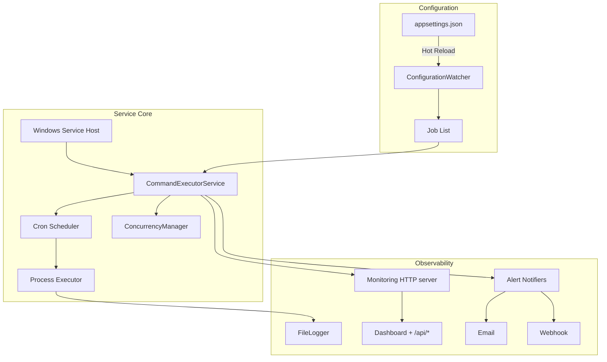

# Scheduled Command Executor — Windows Service

A lightweight **.NET 9 Windows Service** that runs commands on cron schedules, with concurrency control, per‑job timeouts, a live monitoring dashboard, optional email/webhook alerts, and a simple JSON config with hot‑reload.

[](https://github.com/peopleworks/RunCommandsService/actions/workflows/build.yml)


> **v2.9 — Production resilience & observability:** 80+ timezone mappings, startup validation report, scheduler heartbeat on `/api/health`, exponential backoff on errors, and richer diagnostics throughout. See the [Changelog](#-changelog) for the full history.

---

## 🔍 Overview

This service lets administrators:

- Schedule command execution using standard cron expressions (with per‑job time zones).
- Update jobs **without restarting** the service (hot‑reload of `appsettings.json`).
- Monitor execution through a built‑in HTTP dashboard and a JSON health endpoint.
- Run jobs safely with concurrency locks, per‑job timeouts, and optional alerts.

## ✨ Features

- **Cron-based scheduling** — standard 5‑field cron expressions, computed with [Cronos](https://github.com/HangfireIO/Cronos).
- **Per-job time zones** — 80+ IANA IDs plus native Windows IDs, with DST‑correct next‑run calculation.
- **Safe concurrency** — global `MaxParallelism` plus per‑job `ConcurrencyKey` locks to prevent overlap on shared resources.
- **Runtime limits** — per‑job `MaxRuntimeMinutes` auto‑kills hung processes.
- **Hot configuration reload** — edits to `appsettings.json` apply without a restart; a bad edit keeps the previous valid config.
- **Live dashboard** — KPIs, scheduled jobs, recent executions, and a tail of the service logs, all in local time.
- **Job Builder UI** — create/edit/delete jobs from the dashboard with a cron preview (admin‑key protected).
- **Proactive alerts** — email and/or webhook (Slack/Teams/Discord) on consecutive failures and slow runs.
- **Observability** — `/api/health` exposes execution history and a scheduler heartbeat for early failure detection.

## 🏗️ Architecture


```mermaid
flowchart TB
    subgraph Configuration
        A[appsettings.json] -->|Hot Reload| B[ConfigurationWatcher]
        B --> C[Job List]
    end

    subgraph Service Core
        D[Windows Service Host] --> E[CommandExecutorService]
        C --> E
        E --> F[Cron Scheduler]
        F --> G[Process Executor]
        E --> CK[ConcurrencyManager]
    end

    subgraph Observability
        G --> H[FileLogger]
        E --> M[Monitoring HTTP server]
        M --> DASH[Dashboard + /api/*]
        E --> N[Alert Notifiers]
        N --> Email & Webhook
    end
```

## 📋 Prerequisites

- Windows OS
- [.NET 9.0 SDK](https://dotnet.microsoft.com/download) (to build) / .NET 9 runtime (to run)
- Administrative privileges for service installation and URL ACL reservation

## 🚀 Quick start

**Run in the console (for development):**

```powershell
dotnet build -c Debug
dotnet run --project .\RunCommandsService\RunCommandsService.csproj
```

Then open <http://localhost:5058/> for the dashboard or `curl http://localhost:5058/api/health`.

## 🧩 Install as a Windows Service (recommended)

**1) Publish the binaries**

```powershell
dotnet publish .\RunCommandsService\RunCommandsService.csproj -c Release -o C:\Apps\RunCommandsService
```

**2) Reserve the HTTP prefix** (run PowerShell as Administrator)

```powershell
# For the Windows service running as LocalSystem:
netsh http add urlacl url=http://+:5058/ user="NT AUTHORITY\SYSTEM"

# Or, for a local debug run under your current user:
netsh http add urlacl url=http://localhost:5058/ user="%USERDOMAIN%\%USERNAME%"
```

**3) Create and start the service**

```powershell
sc.exe create "ScheduledCommandExecutor" binPath= "C:\Apps\RunCommandsService\RunCommandsService.exe" start= auto
sc.exe start "ScheduledCommandExecutor"
```

Or with PowerShell:

```powershell
New-Service -Name "ScheduledCommandExecutor" `
            -BinaryPathName "C:\Apps\RunCommandsService\RunCommandsService.exe" `
            -DisplayName "Scheduled Command Executor" `
            -Description "Executes scheduled commands from appsettings.json" `
            -StartupType Automatic
Start-Service "ScheduledCommandExecutor"
```

**4) Verify**

```powershell
curl http://localhost:5058/api/health
start http://localhost:5058/
```

**Updating / uninstalling**

- Update: `sc.exe stop ScheduledCommandExecutor`, replace files in `C:\Apps\RunCommandsService`, then `sc.exe start ScheduledCommandExecutor`.
- Uninstall: `sc.exe stop ScheduledCommandExecutor` then `sc.exe delete ScheduledCommandExecutor`.

> **Note:** `Monitoring.HttpPrefixes` must contain `http://localhost:5058/` (with trailing slash) to match the reserved URL ACL.

## ⚙️ Configuration

Configuration lives in `appsettings.json`. A minimal example:

```json
{
  "Scheduler": {
    "PollSeconds": 5,
    "MaxParallelism": 2,
    "DefaultTimeZone": "Eastern Standard Time"
  },
  "Monitoring": {
    "EnableHttpEndpoint": true,
    "AdminKey": "put-a-strong-random-key-here",
    "HttpPrefixes": [ "http://localhost:5058/" ],
    "Dashboard": { "Enabled": true, "HtmlPath": "dashboard.html", "AutoRefreshSeconds": 5 },
    "AlertOn": { "ConsecutiveFailures": 2, "SlowRunMs": 60000 },
    "Notifiers": {
      "Email":   { "Enabled": false, "SmtpHost": "smtp.example.com", "SmtpPort": 587, "UseSsl": true,
                   "User": "user@example.com", "Password": "CHANGE_ME",
                   "From": "alerts@example.com", "To": [ "ops@example.com" ] },
      "Webhook": { "Enabled": false, "Url": "https://hooks.example.com/your-webhook" }
    }
  },
  "ScheduledCommands": [
    {
      "Id": "hourly-report",
      "Command": "powershell.exe -ExecutionPolicy Bypass -File C:\\Jobs\\HourlyReport.ps1",
      "CronExpression": "0 * * * *",
      "TimeZone": "America/New_York",
      "Enabled": true,
      "AllowParallelRuns": false,
      "ConcurrencyKey": "reports",
      "MaxRuntimeMinutes": 20,
      "AlertOnFail": true,
      "CaptureOutput": true,
      "QuietStartLog": false,
      "CustomAlertMessage": "Friendly context included in alerts"
    }
  ]
}
```

### Per-job options

| Option | Type | Description |
| --- | --- | --- |
| `Id` | string (required) | Unique job identifier. |
| `Command` | string (required) | Full shell command. Windows examples often use `cmd /c "..."` with quoting. |
| `CronExpression` | string (required) | 5‑field cron (`min hour dom mon dow`). |
| `TimeZone` | string | IANA (e.g. `Asia/Tokyo`) or Windows ID (e.g. `Eastern Standard Time`). Invalid IDs log a warning and fall back to `Scheduler.DefaultTimeZone`. |
| `Enabled` | bool | Include/exclude from scheduling. |
| `AllowParallelRuns` | bool | If `false`, jobs sharing a `ConcurrencyKey` won't overlap. |
| `ConcurrencyKey` | string | Grouping key for mutual exclusion. Defaults to `Id` if empty. |
| `MaxRuntimeMinutes` | int? | Cancels and kills the process after this duration. |
| `AlertOnFail` | bool | Send alerts on failure (via `Monitoring.Notifiers`). |
| `CaptureOutput` | bool | If `true`, stdout/stderr are captured and logged; stderr content marks the run failed. |
| `QuietStartLog` | bool | Suppresses the "Executing…" start log — useful for very frequent jobs. |
| `CustomAlertMessage` | string | Extra context inserted into email/webhook templates. |

### Scheduler & monitoring options

- `Scheduler.PollSeconds` — how often the scheduler checks for due jobs.
- `Scheduler.MaxParallelism` — global cap on concurrent job executions.
- `Scheduler.DefaultTimeZone` — fallback time zone for jobs without one.
- `Monitoring.HttpPrefixes` — prefixes for the built‑in HTTP server.
- `Monitoring.AdminKey` — required (as the `X-Admin-Key` header) for Job Builder write APIs.

### Cron quick reference

```
┌───────── minute (0-59)
│ ┌─────── hour (0-23)
│ │ ┌───── day of month (1-31)
│ │ │ ┌─── month (1-12)
│ │ │ │ ┌─ day of week (0-6, Sun=0)
* * * * *
```

| Expression | Meaning |
| --- | --- |
| `0 0 * * *` | Daily at midnight |
| `*/15 * * * *` | Every 15 minutes |
| `0 */4 * * *` | Every 4 hours |
| `40 23 * * 1-5` | 23:40, Monday–Friday |

Use [crontab.guru](https://crontab.guru/) to experiment, or the dashboard's **Preview** button to see the next runs.

## 📡 HTTP API

| Method & path | Description |
| --- | --- |
| `GET /` | HTML monitoring dashboard. |
| `GET /api/health` | Execution history, KPIs, and scheduler heartbeat (JSON). |
| `GET /api/logs?tailKb=128` | Last *N* KB of the newest log file (`text/plain`). |
| `GET /api/jobs` | List current jobs from config. |
| `POST /api/jobs/validateCron` | Body `{ "cron": "...", "timeZone": "..." }` → next runs preview. |
| `POST /api/jobs` | Create a job. |
| `PUT /api/jobs/{id}` | Update a job by id. |
| `DELETE /api/jobs/{id}` | Delete a job by id. |

Write endpoints (`POST`/`PUT`/`DELETE`) require the header `X-Admin-Key: <Monitoring.AdminKey>`. A lowercase alias `POST /api/jobs/validatecron` is also accepted.

### Scheduler health (`/api/health`)

```json
{
  "schedulerHealth": {
    "healthy": true,
    "lastHeartbeat": "2025-10-17T15:30:45.123Z",
    "secondsSinceHeartbeat": 2.5,
    "consecutiveErrors": 0,
    "pollIntervalSeconds": 5
  }
}
```

Alert if `healthy = false` or `consecutiveErrors >= 3`, and watch that `secondsSinceHeartbeat` stays below `3 × pollIntervalSeconds`.

## 📊 Dashboard

Open the root URL for a self‑contained UI that shows:

- **KPI cards** — Events, OK, Failed, Avg Duration.
- **Scheduled Jobs** — cron, time zone, concurrency key, next run (job TZ, hover for UTC).
- **Recent Executions** — exit code, duration, status (OK / FAIL / Skipped (lock)), in local time.
- **Service Logs (tail)** — live tail with follow & size selector.
- **Job Builder** — the **“+ New job”** wizard creates jobs via the API with a cron preview (requires `Monitoring.AdminKey`).

## 🧪 Recipes

**Run a script hourly, one at a time, killed after 20 min:**

```json
{
  "Id": "hourly-report",
  "Command": "powershell.exe -ExecutionPolicy Bypass -File C:\\Jobs\\HourlyReport.ps1",
  "CronExpression": "0 * * * *",
  "TimeZone": "America/New_York",
  "AllowParallelRuns": false,
  "ConcurrencyKey": "reports",
  "MaxRuntimeMinutes": 20,
  "AlertOnFail": true
}
```

**Two independent tasks that may run concurrently (different keys):**

```json
{ "Id": "cache-warm", "Command": "C:\\Jobs\\Warm.exe", "CronExpression": "*/10 * * * *", "ConcurrencyKey": "cache" },
{ "Id": "log-trim",   "Command": "C:\\Jobs\\Trim.exe", "CronExpression": "*/10 * * * *", "ConcurrencyKey": "logs"  }
```

**Detached / fire‑and‑forget (launch a daemon without blocking the scheduler):**

```json
{
  "Id": "DashboardPipeline",
  "Command": "cmd /c \"pushd C:\\\\Apps\\\\Dashboard && start \\\"\\\" /b \\\"%ProgramFiles%\\\\nodejs\\\\node.exe\\\" src\\\\main.js process\"",
  "CronExpression": "40 23 * * 1-5",
  "TimeZone": "Eastern Standard Time",
  "AllowParallelRuns": false,
  "ConcurrencyKey": "dashboard",
  "MaxRuntimeMinutes": 5,
  "CaptureOutput": false,
  "QuietStartLog": true,
  "CustomAlertMessage": "Pipeline kicked off; see the app's own logs for runtime details."
}
```

`start "" /b …` returns immediately, so the scheduler isn't blocked. Keep `CaptureOutput: false` (the app handles its own logging). If overlap is risky, guard with a PID/lock inside your app.

## 🪵 Logging

Logs are written to the `Logs` directory (the API also reads from the app base, `log/`, or `logs/`):

- Daily files (`log_yyyy-MM-dd.txt`), rotated after 30 days, 10 MB cap per file.
- Failure summaries are always written, even when `CaptureOutput = false`.

```
2025-02-23 14:30:15 [Information] Service started
2025-02-23 14:30:16 [Information] Loaded 3 commands from configuration
2025-02-23 14:30:20 [Information] Starting command execution: ...
```

## 🛠️ Project structure

```
RunCommandsService/
├─ Program.cs                  # Host setup (Windows Service, DI, logging)
├─ CommandExecutorService.cs   # Scheduler/executor core (cron, concurrency, timeout)
├─ Monitoring.cs               # HTTP dashboard + /api/* endpoints (incl. Job Builder)
├─ SchedulerOptions.cs         # Scheduler configuration model
├─ TimeZoneHelper.cs           # IANA ↔ Windows time-zone resolution
├─ FileLogger.cs               # Rolling daily file logger
├─ WebhookNotifier.cs          # Optional webhook alert notifier (IAlertNotifier)
├─ HealthHttpServerService.cs  # Back-compat no-op hosted service
├─ dashboard.html              # Standalone dashboard UI
├─ appsettings.json            # Configuration
└─ Logs/                       # (runtime) log directory
```

## 🚨 Troubleshooting

| Symptom | Things to check |
| --- | --- |
| Service won't start | Windows Event Viewer; valid `appsettings.json`; log directory permissions; startup validation summary in logs. |
| Commands not executing | Cron expression validity; full command paths; startup logs for "invalid CronExpression" or timezone warnings. |
| Config not updating | File permissions; reload events in logs (a bad edit keeps the previous config). |
| Jobs at wrong times | Timezone warnings in startup logs; valid TZ id; `/api/health` for fallback warnings. |
| Scheduler not responding | `schedulerHealth` in `/api/health`; `consecutiveErrors`; CRITICAL log lines; `lastHeartbeat` freshness. |

## 📈 Changelog

- **v2.9** — Production resilience: 80+ timezone mappings with explicit fallback warnings, startup validation report, scheduler heartbeat on `/api/health`, exponential backoff (10s→20s→40s→60s) with critical alerts after 3+ failures, protected hot‑reload, richer error context.
- **v2.8** — DST‑correct next‑run using Cronos with a UTC base + job TZ; non‑blocking scheduler loop; `validateCron` lowercase alias and runtime parity.
- **v2.7** — Local‑time dashboard timestamps with UTC hints; guaranteed failure summaries regardless of `CaptureOutput`.
- **v2.6** — Edge‑to‑edge responsive dashboard, adaptive KPI grid, mobile‑friendly tables, safer Windows‑service hosting.
- **v2.5** — No page‑level horizontal scroll, version chip, KPI cards, sortable executions, live log tail, experimental Job Builder.
- **v2.4** — Job Builder UI + write APIs, admin key protection, graceful shutdown, expanded config docs.
- **v2.3** — Wide mode, sticky headers, live logs panel, more robust scheduling, clean timeout/kill.
- **v2.2** — Silent jobs (`CaptureOutput`, `QuietStartLog`).
- **v2.1** — Templated email alerts, full HTML dashboard, camelCase API payloads.
- **v2.0** — Health endpoint, proactive alerts, safe concurrency, runtime limits, precise scheduler, hot‑reload.

## 🤝 Contributing

1. Fork the repository
2. Create a feature branch
3. Commit your changes
4. Push to the branch
5. Open a Pull Request

## 📜 License

[MIT](LICENSE) — free to use in your own projects.

## 🔗 Related resources

- [Windows Services documentation](https://learn.microsoft.com/dotnet/framework/windows-services/)
- [Cron expression generator (crontab.guru)](https://crontab.guru/)
- [.NET documentation](https://learn.microsoft.com/dotnet/core/)
