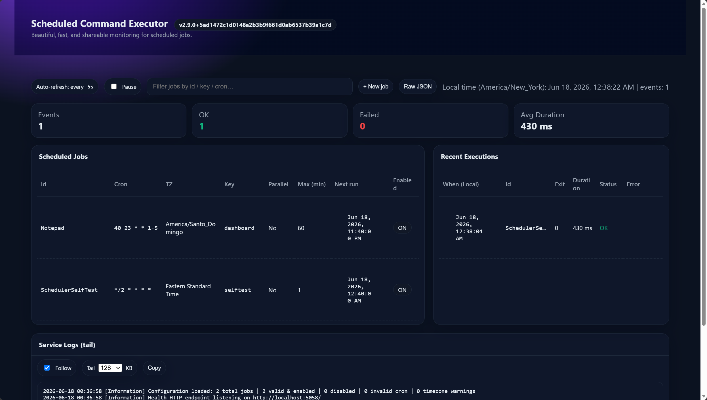
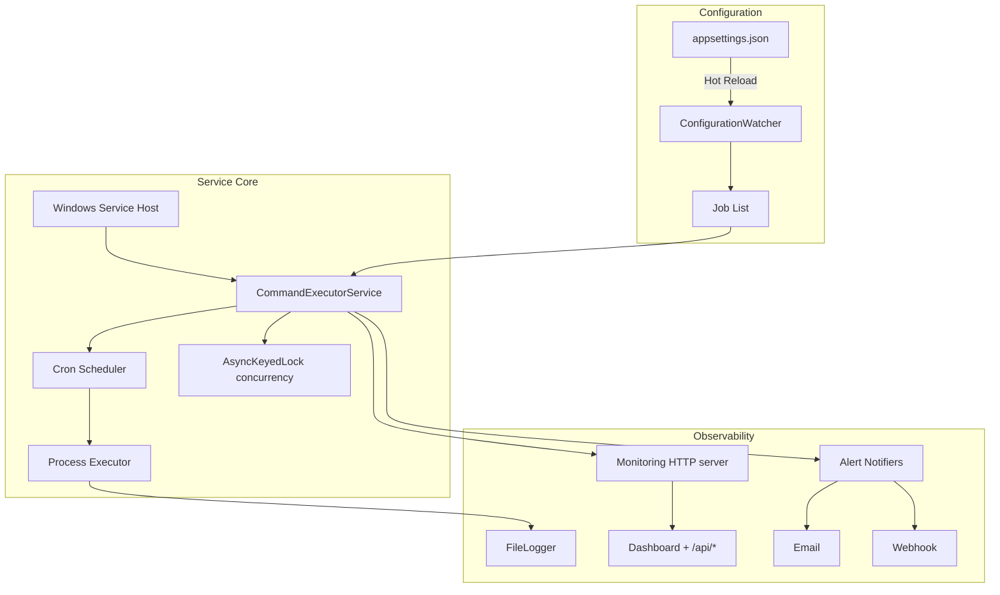
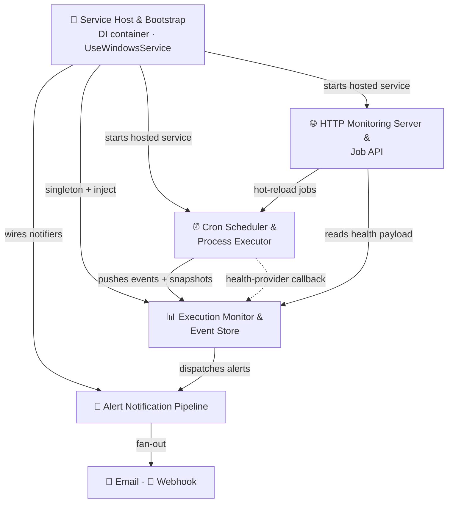

# Scheduled Command Executor — Windows Service

A lightweight **.NET 10 Windows Service** that runs commands on cron schedules, with concurrency control, per‑job timeouts, a live monitoring dashboard, optional email/webhook alerts, and a simple JSON config with hot‑reload.

[](https://github.com/peopleworks/RunCommandsService/actions/workflows/build.yml)


> **v2.11.0 — Persistent operations:** SQLite execution history, per-job duration/retry metrics, protected manual runs, and portable job import/export. See the [Changelog](#-changelog) for the full history.

---

## 📸 Dashboard preview



*Live dashboard: KPI cards, scheduled jobs with next-run times, recent executions, and a tail of the service logs — all in your local time.*

## 🔍 Overview

This service lets administrators:

- Schedule command execution using standard cron expressions (with per‑job time zones).
- Update jobs **without restarting** the service (hot‑reload of `appsettings.json`).
- Monitor execution through a built‑in HTTP dashboard and a JSON health endpoint.
- Run jobs safely with concurrency locks, per‑job timeouts, and optional alerts.

## ✨ Features

- **Cron-based scheduling** — standard 5‑field cron expressions, computed with [Cronos](https://github.com/HangfireIO/Cronos).
- **Per-job time zones** — 80+ IANA IDs plus native Windows IDs, with DST‑correct next‑run calculation.
- **Safe concurrency** — global `MaxParallelism` plus per‑job `ConcurrencyKey` locks to prevent overlap on shared resources.
- **Runtime limits** — per‑job `MaxRuntimeMinutes` auto‑kills hung processes.
- **Safe retries** — opt-in per-job attempts with bounded exponential backoff, jitter, and failure filters.
- **Persistent history & metrics** — SQLite-backed results survive restarts and feed per-job retry/duration statistics.
- **Manual operations** — run a configured job on demand and import/export job sets through admin-key-protected APIs.
- **Hot configuration reload** — edits to `appsettings.json` apply without a restart; a bad edit keeps the previous valid config.
- **Live dashboard** — KPIs, scheduled jobs, recent executions, and a tail of the service logs, all in local time.
- **Job Builder UI** — create/edit/delete jobs from the dashboard with a cron preview (admin‑key protected).
- **Proactive alerts** — email and/or webhook (Slack/Teams/Discord) on consecutive failures and slow runs.
- **Observability** — `/api/health` exposes execution history and a scheduler heartbeat for early failure detection.

## 🏗️ Architecture


```mermaid
flowchart TB
    subgraph Configuration
        A[appsettings.json] -->|Hot Reload| B[ConfigurationWatcher]
        B --> C[Job List]
    end

    subgraph Service Core
        D[Windows Service Host] --> E[CommandExecutorService]
        C --> E
        E --> F[Cron Scheduler]
        F --> G[Process Executor]
        E --> CK[AsyncKeyedLock concurrency]
    end

    subgraph Observability
        G --> H[FileLogger]
        E --> M[Monitoring HTTP server]
        M --> DASH[Dashboard + /api/*]
        E --> N[Alert Notifiers]
        N --> Email & Webhook
    end
```

### 🗺️ Component map

> Auto-generated from the source by [CodeBoarding](https://github.com/CodeBoarding/CodeBoarding) (reasoning by Claude). Five components and how they collaborate at runtime:


```mermaid
flowchart TD
    Host["🧩 Service Host & Bootstrap<br/>DI container · UseWindowsService"]
    Sched["⏰ Cron Scheduler &<br/>Process Executor"]
    Mon["📊 Execution Monitor &<br/>Event Store"]
    Alert["🔔 Alert Notification Pipeline"]
    Http["🌐 HTTP Monitoring Server &<br/>Job API"]
    Out["📧 Email · 🔗 Webhook"]

    Host -->|starts hosted service| Sched
    Host -->|starts hosted service| Http
    Host -->|singleton + inject| Mon
    Host -->|wires notifiers| Alert

    Sched -->|pushes events + snapshots| Mon
    Sched -.->|health-provider callback| Mon
    Mon -->|dispatches alerts| Alert
    Alert -->|fan-out| Out
    Http -->|reads health payload| Mon
    Http -->|hot-reload jobs| Sched
```

| Component | Responsibility |
| --- | --- |
| ⏰ **Cron Scheduler & Process Executor** | Polls every `PollSeconds`, computes DST-safe next-run times via Cronos, runs due jobs as `cmd.exe` processes with two-layer concurrency, and hot-reloads jobs from `appsettings.json`. |
| 📊 **Execution Monitor & SQLite Store** | Central event sink: rolling in-memory queue plus retained SQLite history, per-job retry/duration metrics, consecutive-failure tracking, a live schedule snapshot, and health/API payloads. |
| 🔔 **Alert Notification Pipeline** | `CompositeNotifier` fans alerts out to Email (SMTP) and Webhook (HTTP), each fault-isolated so one channel failure can't block the others. |
| 🌐 **HTTP Monitoring Server & Job API** | Embedded `HttpListener` serving the live dashboard, `/api/health`, a log-tail endpoint, and an admin-key-gated CRUD REST API with atomic config writes. |
| 🧩 **Service Host & Bootstrap** | Composition root: wires the DI container, registers the hosted services, installs the file logger, and integrates with the Windows SCM. |

## 📋 Prerequisites

- Windows OS
- [.NET 10.0 SDK](https://dotnet.microsoft.com/download) (to build) / .NET 10 runtime (to run)
- Administrative privileges for service installation and URL ACL reservation

## 🚀 Quick start

**Run in the console (for development):**

```powershell
dotnet build -c Debug
dotnet run --project .\RunCommandsService.csproj
```

Then open <http://localhost:5058/> for the dashboard or `curl http://localhost:5058/api/health`.

**Validate the configuration without running anything (`--validate`):**

```powershell
dotnet run --project .\RunCommandsService.csproj -- --validate
```

This loads `appsettings.json`, checks every job in `ScheduledCommands` (required `Id`/`Command`, a
parseable `CronExpression`, and a resolvable `TimeZone`), prints a per-job report, and **executes no
commands**. It exits with code `0` when all jobs are valid and a non-zero code otherwise — handy as a
pre-deploy or CI gate. `--check` is accepted as an alias.

```text
Configuration validation report
===============================
  [OK]   Notepad
  [FAIL] SchedulerSelfTest
           - invalid CronExpression — ...
-------------------------------
2 job(s): 1 valid, 1 invalid.
```

## 🧩 Install as a Windows Service (recommended)

**1) Publish the binaries**

```powershell
dotnet publish .\RunCommandsService.csproj -c Release -o C:\Apps\RunCommandsService
```

**2) Reserve the HTTP prefix** (run PowerShell as Administrator)

```powershell
# For the Windows service running as LocalSystem:
netsh http add urlacl url=http://+:5058/ user="NT AUTHORITY\SYSTEM"

# Or, for a local debug run under your current user:
netsh http add urlacl url=http://localhost:5058/ user="%USERDOMAIN%\%USERNAME%"
```

**3) Create and start the service**

```powershell
sc.exe create "ScheduledCommandExecutor" binPath= "C:\Apps\RunCommandsService\RunCommandsService.exe" start= auto
sc.exe start "ScheduledCommandExecutor"
```

Or with PowerShell:

```powershell
New-Service -Name "ScheduledCommandExecutor" `
            -BinaryPathName "C:\Apps\RunCommandsService\RunCommandsService.exe" `
            -DisplayName "Scheduled Command Executor" `
            -Description "Executes scheduled commands from appsettings.json" `
            -StartupType Automatic
Start-Service "ScheduledCommandExecutor"
```

**4) Verify**

```powershell
curl http://localhost:5058/api/health
start http://localhost:5058/
```

**Updating / uninstalling**

- Update: `sc.exe stop ScheduledCommandExecutor`, replace files in `C:\Apps\RunCommandsService`, then `sc.exe start ScheduledCommandExecutor`.
- Uninstall: `sc.exe stop ScheduledCommandExecutor` then `sc.exe delete ScheduledCommandExecutor`.

> **Note:** `Monitoring.HttpPrefixes` must contain `http://localhost:5058/` (with trailing slash) to match the reserved URL ACL.

## ⚙️ Configuration

Configuration lives in `appsettings.json`. A minimal example:

```json
{
  "Scheduler": {
    "PollSeconds": 5,
    "MaxParallelism": 2,
    "DefaultTimeZone": "Eastern Standard Time"
  },
  "Monitoring": {
    "EnableHttpEndpoint": true,
    "MaxRequestBodyBytes": 65536,
    "AdminKey": "put-a-strong-random-key-here",
    "HttpPrefixes": [ "http://localhost:5058/" ],
    "ExecutionHistory": { "Enabled": true, "DatabasePath": "Data/executions.db", "RetentionDays": 90, "MaxRecords": 100000 },
    "Dashboard": { "Enabled": true, "HtmlPath": "dashboard.html", "AutoRefreshSeconds": 5 },
    "AlertOn": { "ConsecutiveFailures": 2, "SlowRunMs": 60000 },
    "Notifiers": {
      "Email":   { "Enabled": false, "SmtpHost": "smtp.example.com", "SmtpPort": 587, "UseSsl": true,
                   "User": "user@example.com", "Password": "CHANGE_ME",
                   "From": "alerts@example.com", "To": [ "ops@example.com" ] },
      "Webhook": { "Enabled": false, "Url": "https://hooks.example.com/your-webhook" }
    }
  },
  "ScheduledCommands": [
    {
      "Id": "hourly-report",
      "Command": "powershell.exe -ExecutionPolicy Bypass -File C:\\Jobs\\HourlyReport.ps1",
      "CronExpression": "0 * * * *",
      "TimeZone": "America/New_York",
      "Enabled": true,
      "AllowParallelRuns": false,
      "ConcurrencyKey": "reports",
      "MaxRuntimeMinutes": 20,
      "Retry": {
        "MaxAttempts": 3,
        "InitialDelaySeconds": 10,
        "BackoffMultiplier": 2.0,
        "MaxDelaySeconds": 300,
        "JitterPercent": 20,
        "RetryableExitCodes": [ 1, 2 ],
        "RetryOnTimeout": false,
        "RetryOnException": false
      },
      "AlertOnFail": true,
      "CaptureOutput": true,
      "QuietStartLog": false,
      "CustomAlertMessage": "Friendly context included in alerts"
    }
  ]
}
```

### Per-job options

| Option | Type | Description |
| --- | --- | --- |
| `Id` | string (required) | Unique job identifier. |
| `Command` | string (required) | Full shell command. Windows examples often use `cmd /c "..."` with quoting. |
| `CronExpression` | string (required) | 5‑field cron (`min hour dom mon dow`). |
| `TimeZone` | string | IANA (e.g. `Asia/Tokyo`) or Windows ID (e.g. `Eastern Standard Time`). Invalid IDs log a warning and fall back to `Scheduler.DefaultTimeZone`. |
| `Enabled` | bool | Include/exclude from scheduling. |
| `AllowParallelRuns` | bool | If `false`, jobs sharing a `ConcurrencyKey` won't overlap. |
| `ConcurrencyKey` | string | Grouping key for mutual exclusion. Defaults to `Id` if empty. |
| `MaxRuntimeMinutes` | int? | Cancels and kills the process after this duration. |
| `Retry` | object | Opt-in retry policy. `MaxAttempts=1` disables retries (default). |
| `AlertOnFail` | bool | Send alerts on failure (via `Monitoring.Notifiers`). |
| `CaptureOutput` | bool | If `true`, stdout/stderr are captured and logged. |
| `MaxOutputKB` | int | Limit captured stdout/stderr buffer size in KB (default `512`). |
| `TreatStdErrAsFailure` | bool | If `true`, non-empty `stderr` marks the execution as failed even if `ExitCode == 0`. Default is `false` (success is determined by `ExitCode == 0`). |
| `QuietStartLog` | bool | Suppresses the "Executing…" start log — useful for very frequent jobs. |
| `CustomAlertMessage` | string | Extra context inserted into email/webhook templates. |

### Retry policy

Retries are disabled unless `Retry.MaxAttempts` is greater than `1`. The concurrency key remains reserved for the whole logical run, while the global parallelism slot is released during backoff. This prevents overlapping occurrences without wasting execution capacity.

| Option | Range/default | Description |
| --- | --- | --- |
| `MaxAttempts` | `1..10`, default `1` | Total attempts including the initial execution. |
| `InitialDelaySeconds` | `0..3600`, default `10` | Delay before the first retry. |
| `BackoffMultiplier` | `1..10`, default `2.0` | Exponential multiplier after each failure. |
| `MaxDelaySeconds` | up to `86400`, default `300` | Hard cap applied after jitter. Must be at least the initial delay. |
| `JitterPercent` | `0..100`, default `20` | Symmetric random variation that avoids synchronized retry storms. |
| `RetryableExitCodes` | default `[]` | Eligible exit codes. Empty means every unsuccessful exit-code result. Include `0` to retry a `TreatStdErrAsFailure` result. |
| `RetryOnTimeout` | default `false` | Retry after the per-attempt runtime limit kills the process tree. |
| `RetryOnException` | default `false` | Retry process-start or execution infrastructure exceptions. |

Only enable retries for commands known to be idempotent, or whose duplicate effects are otherwise controlled.

### Scheduler & monitoring options

- `Scheduler.PollSeconds` — how often the scheduler checks for due jobs.
- `Scheduler.MaxParallelism` — global cap on concurrent job executions.
- `Scheduler.DefaultTimeZone` — fallback time zone for jobs without one.
- `Monitoring.HttpPrefixes` — prefixes for the built‑in HTTP server.
- `Monitoring.MaxRequestBodyBytes` — maximum JSON request body size, from `1024` to `1048576` bytes (default `65536`). Oversized requests return HTTP 413.
- `Monitoring.AdminKey` — required (as the `X-Admin-Key` header) for Job Builder write APIs.
- `Monitoring.ExecutionHistory` — SQLite persistence settings: `Enabled`, `DatabasePath`, `RetentionDays` (`1..3650`), and `MaxRecords` (`100..10000000`).

For deployments, keep the real admin key out of committed JSON and set it with the `Monitoring__AdminKey` environment variable. Plain HTTP should remain bound to loopback; use HTTPS at a reverse proxy for remote access.

### Cron quick reference

```
┌───────── minute (0-59)
│ ┌─────── hour (0-23)
│ │ ┌───── day of month (1-31)
│ │ │ ┌─── month (1-12)
│ │ │ │ ┌─ day of week (0-6, Sun=0)
* * * * *
```

| Expression | Meaning |
| --- | --- |
| `0 0 * * *` | Daily at midnight |
| `*/15 * * * *` | Every 15 minutes |
| `0 */4 * * *` | Every 4 hours |
| `40 23 * * 1-5` | 23:40, Monday–Friday |

Use [crontab.guru](https://crontab.guru/) to experiment, or the dashboard's **Preview** button to see the next runs.

## 📡 HTTP API

| Method & path | Description |
| --- | --- |
| `GET /` | HTML monitoring dashboard. |
| `GET /api/health` | Execution history, KPIs, and scheduler heartbeat (JSON). |
| `GET /api/history?jobId={id}&limit=100` | Persistent execution history (up to 5,000 records). |
| `GET /api/logs?tailKb=128` | Last *N* KB of the newest log file (`text/plain`). |
| `GET /api/jobs` | List current jobs from config. |
| `POST /api/jobs/validateCron` | Body `{ "cron": "...", "timeZone": "..." }` → next runs preview. |
| `POST /api/jobs` | Create a job. |
| `PUT /api/jobs/{id}` | Update a job by id. |
| `DELETE /api/jobs/{id}` | Delete a job by id. |
| `POST /api/jobs/{id}/run` | Queue a manual run through normal concurrency/retry controls. |
| `GET /api/config/export` | Export `ScheduledCommands` only (no monitoring secrets). |
| `POST /api/config/import` | Import `{ "mode":"replace|merge", "scheduledCommands":[...] }` atomically. |

Administrative endpoints (job writes, manual run, import, and export) require the header `X-Admin-Key: <Monitoring.AdminKey>`. A lowercase alias `POST /api/jobs/validatecron` is also accepted. Manual execution also works for a disabled job because it is an explicit operator action.

```powershell
$headers = @{ "X-Admin-Key" = $env:RCS_ADMIN_KEY }
Invoke-RestMethod -Method Post -Headers $headers http://localhost:5058/api/jobs/hourly-report/run
Invoke-RestMethod -Headers $headers http://localhost:5058/api/config/export | ConvertTo-Json -Depth 20 | Set-Content jobs-export.json
$body = Get-Content jobs-export.json -Raw
Invoke-RestMethod -Method Post -ContentType application/json -Headers $headers -Body $body http://localhost:5058/api/config/import
```

### Scheduler health (`/api/health`)

```json
{
  "schedulerHealth": {
    "healthy": true,
    "lastHeartbeat": "2025-10-17T15:30:45.123Z",
    "secondsSinceHeartbeat": 2.5,
    "consecutiveErrors": 0,
    "pollIntervalSeconds": 5
  }
}
```

Alert if `healthy = false` or `consecutiveErrors >= 3`, and watch that `secondsSinceHeartbeat` stays below `3 × pollIntervalSeconds`.

## 📊 Dashboard

Open the root URL for a self‑contained UI that shows:

- **KPI cards** — Events, OK, Failed, Avg Duration.
- **Scheduled Jobs** — cron, time zone, concurrency key, next run (job TZ, hover for UTC).
- **Scheduled Jobs metrics/actions** — retained retry count, average duration, and protected **Run** action.
- **Recent Executions** — trigger source, exit code, duration, status (OK / FAIL / Skipped (lock)), in local time.
- **Configuration transfer** — protected import/export buttons for portable job sets.
- **Service Logs (tail)** — live tail with follow & size selector.
- **Job Builder** — the **“+ New job”** wizard creates jobs via the API with a cron preview (requires `Monitoring.AdminKey`).

## 🧪 Recipes

**Run a script hourly, one at a time, killed after 20 min:**

```json
{
  "Id": "hourly-report",
  "Command": "powershell.exe -ExecutionPolicy Bypass -File C:\\Jobs\\HourlyReport.ps1",
  "CronExpression": "0 * * * *",
  "TimeZone": "America/New_York",
  "AllowParallelRuns": false,
  "ConcurrencyKey": "reports",
  "MaxRuntimeMinutes": 20,
  "AlertOnFail": true
}
```

**Two independent tasks that may run concurrently (different keys):**

```json
{ "Id": "cache-warm", "Command": "C:\\Jobs\\Warm.exe", "CronExpression": "*/10 * * * *", "ConcurrencyKey": "cache" },
{ "Id": "log-trim",   "Command": "C:\\Jobs\\Trim.exe", "CronExpression": "*/10 * * * *", "ConcurrencyKey": "logs"  }
```

**Detached / fire‑and‑forget (launch a daemon without blocking the scheduler):**

```json
{
  "Id": "DashboardPipeline",
  "Command": "cmd /c \"pushd C:\\\\Apps\\\\Dashboard && start \\\"\\\" /b \\\"%ProgramFiles%\\\\nodejs\\\\node.exe\\\" src\\\\main.js process\"",
  "CronExpression": "40 23 * * 1-5",
  "TimeZone": "Eastern Standard Time",
  "AllowParallelRuns": false,
  "ConcurrencyKey": "dashboard",
  "MaxRuntimeMinutes": 5,
  "CaptureOutput": false,
  "QuietStartLog": true,
  "CustomAlertMessage": "Pipeline kicked off; see the app's own logs for runtime details."
}
```

`start "" /b …` returns immediately, so the scheduler isn't blocked. Keep `CaptureOutput: false` (the app handles its own logging). If overlap is risky, guard with a PID/lock inside your app.

## 🪵 Logging

Logs are written to the `Logs` directory (the API also reads from the app base, `log/`, or `logs/`):

- Daily files (`log_yyyy-MM-dd.txt`), rotated after 30 days, 10 MB cap per file.
- Failure summaries are always written, even when `CaptureOutput = false`.

```
2025-02-23 14:30:15 [Information] Service started
2025-02-23 14:30:16 [Information] Loaded 3 commands from configuration
2025-02-23 14:30:20 [Information] Starting command execution: ...
```

## 🛠️ Project structure

```
RunCommandsService/
├─ Program.cs                  # Host setup (Windows Service, DI, logging)
├─ CommandExecutorService.cs   # Scheduler/executor core (cron, concurrency, timeout)
├─ Monitoring.cs               # HTTP dashboard + /api/* endpoints (incl. Job Builder)
├─ ExecutionHistoryStore.cs    # SQLite history, retention, and per-job metrics
├─ SchedulerOptions.cs         # Scheduler configuration model
├─ TimeZoneHelper.cs           # IANA ↔ Windows time-zone resolution
├─ FileLogger.cs               # Rolling daily file logger
├─ WebhookNotifier.cs          # Optional webhook alert notifier (IAlertNotifier)
├─ HealthHttpServerService.cs  # Back-compat no-op hosted service
├─ dashboard.html              # Standalone dashboard UI
├─ appsettings.json            # Configuration
└─ Logs/                       # (runtime) log directory
```

## 🚨 Troubleshooting

| Symptom | Things to check |
| --- | --- |
| Service won't start | Windows Event Viewer; valid `appsettings.json`; log directory permissions; startup validation summary in logs. |
| Commands not executing | Cron expression validity; full command paths; startup logs for "invalid CronExpression" or timezone warnings. |
| Config not updating | File permissions; reload events in logs (a bad edit keeps the previous config). |
| Jobs at wrong times | Timezone warnings in startup logs; valid TZ id; `/api/health` for fallback warnings. |
| Scheduler not responding | `schedulerHealth` in `/api/health`; `consecutiveErrors`; CRITICAL log lines; `lastHeartbeat` freshness. |

## 📈 Changelog

- **v2.11.0** — Persistent SQLite execution history with bounded retention and restart recovery; per-job retry, timeout, success/failure, and duration metrics in health/dashboard; admin-key-protected manual execution through normal concurrency/retry controls; validated atomic job import/export without secrets; main project compiles with zero warnings; 74 automated tests.
- **v2.10.0** — Configurable per-job retries: total-attempt limits, bounded exponential backoff, symmetric jitter, exit-code allowlists, opt-in timeout/exception retries, cancellation-safe shutdown, concurrency-key reservation across a logical run, release of global capacity during backoff, final-result-only alert accounting, attempt metadata in health/API/dashboard, Job Builder controls, validation, and 70 automated tests.
- **v2.9.2** — Configuration and HTTP hardening: validates scheduler ranges, HTTP prefixes, request limits, per-job limits, webhook URLs, and case-insensitive duplicate IDs; skips malformed/duplicate runtime entries safely; caps JSON bodies with explicit 400/413/415 responses; adds CSP and defensive headers; serializes Job Builder writes with durable atomic replacement and backup; adds version-sync and request-limit regression coverage (57 tests).
- **v2.9.1** — Technical review hardening: migrated to .NET 10 with `global.json`; xUnit test suite (50 tests) with code coverage in CI; file logger with thread-safe size rotation, periodic cleanup (`LastWriteTimeUtc`), and `MinLevel` filtering; success determined by `ExitCode == 0` with opt-in `TreatStdErrAsFailure`; bounded stdout/stderr capture (`MaxOutputKB`); `SecretMasker` with constant-time auth comparison and default-secret rejection; `appsettings.example.json` template; corrected CLI paths in all docs with automated documentation validation tests.
- **v2.9** — Production resilience: 80+ timezone mappings with explicit fallback warnings, startup validation report, scheduler heartbeat on `/api/health`, exponential backoff (10s→20s→40s→60s) with critical alerts after 3+ failures, protected hot‑reload, richer error context.
- **v2.8** — DST‑correct next‑run using Cronos with a UTC base + job TZ; non‑blocking scheduler loop; `validateCron` lowercase alias and runtime parity.
- **v2.7** — Local‑time dashboard timestamps with UTC hints; guaranteed failure summaries regardless of `CaptureOutput`.
- **v2.6** — Edge‑to‑edge responsive dashboard, adaptive KPI grid, mobile‑friendly tables, safer Windows‑service hosting.
- **v2.5** — No page‑level horizontal scroll, version chip, KPI cards, sortable executions, live log tail, experimental Job Builder.
- **v2.4** — Job Builder UI + write APIs, admin key protection, graceful shutdown, expanded config docs.
- **v2.3** — Wide mode, sticky headers, live logs panel, more robust scheduling, clean timeout/kill.
- **v2.2** — Silent jobs (`CaptureOutput`, `QuietStartLog`).
- **v2.1** — Templated email alerts, full HTML dashboard, camelCase API payloads.
- **v2.0** — Health endpoint, proactive alerts, safe concurrency, runtime limits, precise scheduler, hot‑reload.

## 🗺️ Roadmap

Ideas on deck — contributions welcome (look for the [good first issues](../../issues?q=is%3Aissue+is%3Aopen+label%3A%22good+first+issue%22)):

- [x] **Run history & metrics** — persist executions to SQLite and expose per-job retry/duration statistics
- [ ] **More notifiers** — native Telegram / Discord / Microsoft Teams alerts alongside email + webhook
- [ ] **`/metrics` endpoint** — Prometheus-style metrics for scraping
- [ ] **Dashboard auth** — optional login in front of the dashboard and write APIs
- [x] **Job import / export** — share job sets as portable JSON
- [x] **Auto-generated architecture map** — via [CodeBoarding](https://github.com/CodeBoarding/CodeBoarding) (see the [component map](#️-component-map) above)

Have an idea? [Open a feature request](../../issues/new?template=feature_request.md) or start a [discussion](../../discussions).

## 🤝 Contributing

1. Fork the repository
2. Create a feature branch
3. Commit your changes
4. Push to the branch
5. Open a Pull Request

## 📜 License

[MIT](LICENSE) — free to use in your own projects.

## 🔗 Related resources

- [Windows Services documentation](https://learn.microsoft.com/dotnet/framework/windows-services/)
- [Cron expression generator (crontab.guru)](https://crontab.guru/)
- [.NET documentation](https://learn.microsoft.com/dotnet/core/)

---

<div align="center">

### Built by PeopleWorks

Created by **Pedro Hernández — PeopleWorks**,
[Microsoft MVP for .NET](https://mvp.microsoft.com/en-US/mvp/profile/24060a02-dbc6-44ec-bca5-c213ff9835c5)

Built with [.NET 10](https://dotnet.microsoft.com/) · [Cronos](https://github.com/HangfireIO/Cronos) · [HttpListener](https://learn.microsoft.com/dotnet/api/system.net.httplistener)

**PeopleWorks automation & database tools** — **Scheduled Command Executor** runs the jobs ·
[DBFSync](https://github.com/peopleworks/DBFSync) moves legacy data ·
[SQLDiff](https://github.com/peopleworks/SqlSchemaDiff) moves the schema ·
[SyncJob](https://github.com/peopleworks/syncjob) moves relational data

[📖 DBFSync guide](https://peopleworks.github.io/DBFSync/) ·
[📖 SQLDiff guide](https://peopleworks.github.io/SqlSchemaDiff/) ·
[📖 SyncJob guide](https://peopleworks.github.io/syncjob/)

**Built for unattended production workloads, where a missed or duplicated run matters.**

MIT licensed — use it, fork it, ship it.

© 2026 PeopleWorks

</div>
